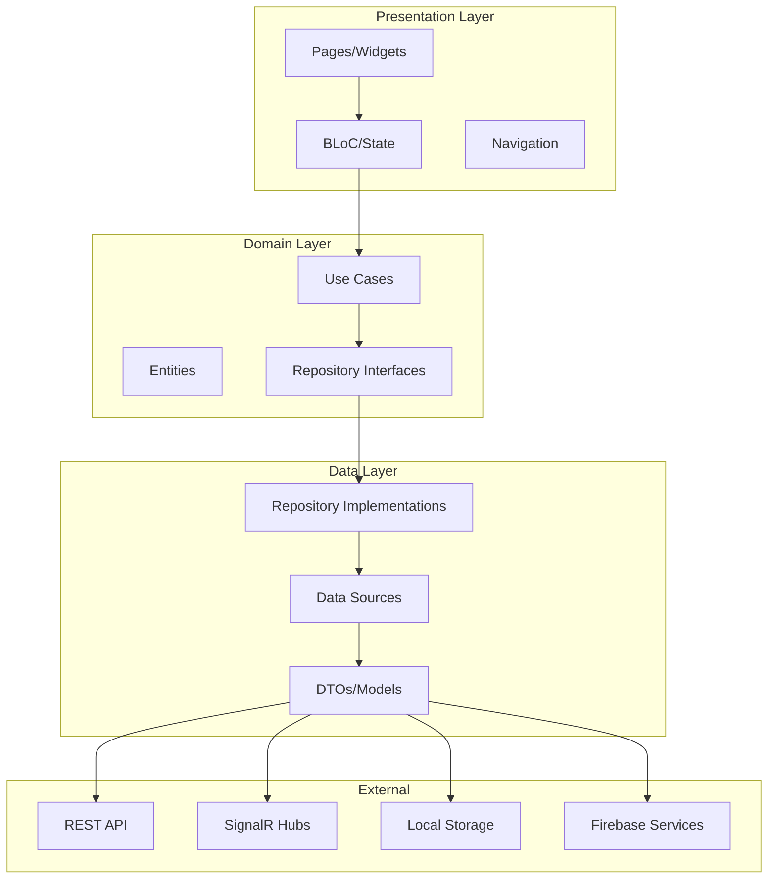
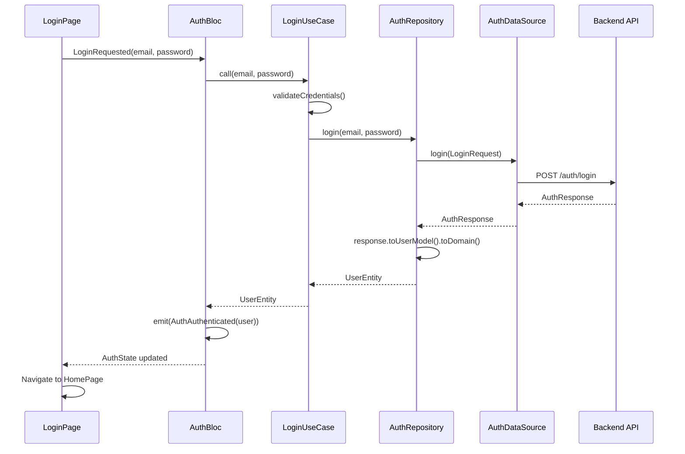
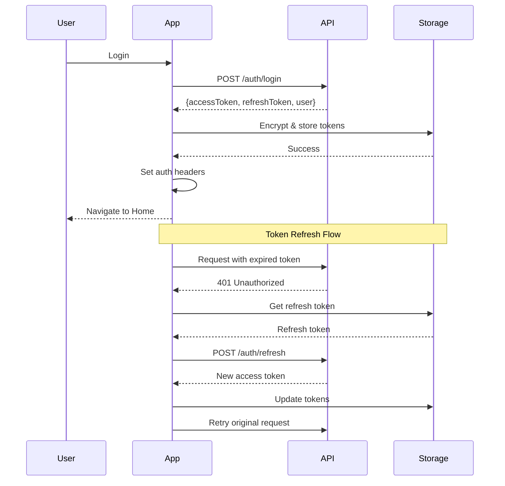
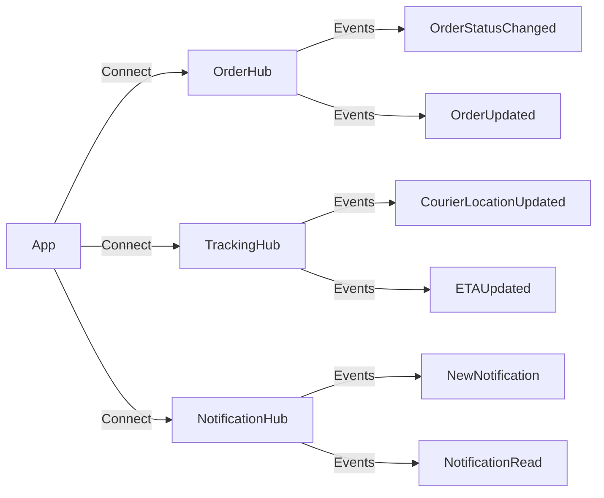
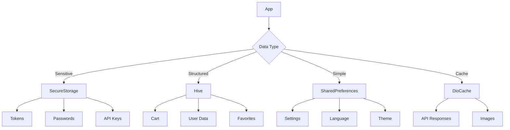
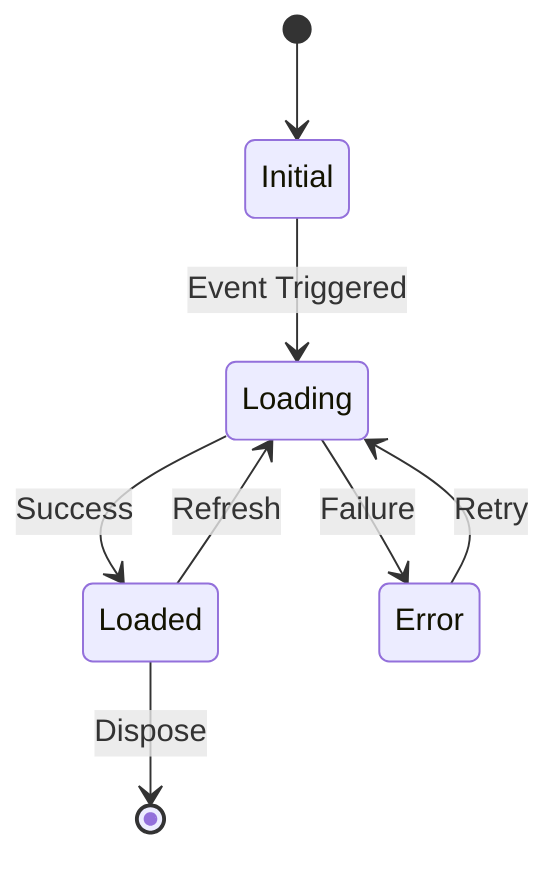

# 🏗️ Getir Mobile - Architecture Documentation

**Version:** 1.0.0  
**Last Updated:** 8 Ekim 2025  
**Architecture Pattern:** Clean Architecture + BLoC

---

## 📐 Architecture Overview

Getir Mobile follows **Clean Architecture** principles with strict layer separation and dependency inversion.



---

## 🎯 Core Principles

### 1. Separation of Concerns
Each layer has a single, well-defined responsibility.

### 2. Dependency Inversion
Higher layers don't depend on lower layers. Dependencies point inward.

### 3. Testability
All business logic is isolated and easily testable.

### 4. Scalability
New features can be added without affecting existing code.

---

## 📦 Layer Details

### 1. Presentation Layer

**Location:** `lib/presentation/`

**Responsibilities:**
- UI rendering
- User interaction handling
- State management
- Navigation

**Components:**

#### Pages (`pages/`)
Complete screens/routes:
- `auth/` - Login, Register, Password Recovery
- `home/` - Home screen, categories
- `merchant/` - Merchant list, detail
- `product/` - Product list, detail
- `cart/` - Shopping cart
- `checkout/` - Checkout flow
- `order/` - Order history, tracking
- `profile/` - User profile, settings

#### Widgets (`widgets/`)
Reusable UI components:
- `common/` - Buttons, inputs, cards
- `merchant/` - Merchant cards, badges
- `product/` - Product cards, variants
- `cart/` - Cart items, summary

#### BLoCs (`bloc/`)
State management:
```dart
AuthBloc - User authentication state
CartBloc - Shopping cart state
MerchantBloc - Merchant data state
ProductBloc - Product data state
OrderBloc - Order state
```

**Communication:**
```
User Action → Event → BLoC → Use Case → State → UI Update
```

---

### 2. Domain Layer

**Location:** `lib/domain/`

**Responsibilities:**
- Business logic
- Entity definitions
- Repository contracts

**Components:**

#### Entities (`entities/`)
Pure business models (no framework dependencies):

```dart
class User {
  final String id;
  final String email;
  final String firstName;
  // ... pure data, no logic
}
```

**Key Entities:**
- `user_entity.dart` - User model
- `merchant.dart` - Merchant model
- `product.dart` - Product model
- `cart.dart` - Cart & CartItem
- `order.dart` - Order model
- `address.dart` - Address model

#### Use Cases (`usecases/`)
Single-responsibility business operations:

```dart
class LoginUseCase {
  final AuthRepository repository;
  
  Future<UserEntity> call(String email, String password) async {
    // Validation
    _validateCredentials(email, password);
    
    // Business logic
    return await repository.login(email, password);
  }
}
```

**Naming Convention:** `{Verb}{Entity}UseCase`
- `LoginUseCase`, `RegisterUseCase`
- `GetCartUseCase`, `AddToCartUseCase`
- `GetMerchantsUseCase`, `GetMerchantByIdUseCase`

#### Repository Interfaces (`repositories/`)
Data access contracts:

```dart
abstract class AuthRepository {
  Future<UserEntity> login(String email, String password);
  Future<UserEntity> register(...);
  Future<void> logout();
}
```

---

### 3. Data Layer

**Location:** `lib/data/`

**Responsibilities:**
- API communication
- Data transformation
- Caching
- Error handling

**Components:**

#### Repositories (`repositories/`)
Interface implementations:

```dart
class AuthRepositoryImpl implements AuthRepository {
  final AuthDataSource dataSource;
  
  @override
  Future<UserEntity> login(String email, String password) async {
    final request = LoginRequest(email: email, password: password);
    final response = await dataSource.login(request);
    return response.toUserModel().toDomain();
  }
}
```

#### Data Sources (`datasources/`)
Direct API/Storage communication:

```dart
class AuthDataSourceImpl implements AuthDataSource {
  final Dio dio;
  
  Future<AuthResponse> login(LoginRequest request) async {
    final response = await dio.post('/auth/login', data: request.toJson());
    return AuthResponse.fromJson(response.data);
  }
}
```

#### Models/DTOs (`models/`)
Data transfer objects:

```dart
class UserModel {
  final String id;
  final String email;
  
  // DTO → Domain
  UserEntity toDomain() => UserEntity(id: id, email: email);
  
  // Domain → DTO
  factory UserModel.fromDomain(UserEntity user) => UserModel(...);
}
```

---

### 4. Core Layer

**Location:** `lib/core/`

**Responsibilities:**
- Dependency injection
- Shared services
- Error handling
- Constants & utilities

**Components:**

#### Dependency Injection (`di/`)
```dart
@InjectableInit()
Future<void> configureDependencies() async {
  await getIt.init();
  registerManualDependencies();
}
```

#### Services (`services/`)
- `LocalStorageService` - Hive + SharedPreferences
- `EncryptionService` - AES encryption
- `SignalRService` - Real-time communication
- `FirebaseService` - Firebase integration
- `NetworkService` - Connectivity monitoring

#### Error Handling (`errors/`)
```
AppException (Base)
├── NetworkException
├── AuthenticationException
├── ValidationException
├── BusinessException
└── UnknownException
```

---

## 🔄 Data Flow

### Example: User Login



### Flow Steps:

1. **UI Layer:** User taps login button
2. **Presentation:** BLoC receives LoginRequested event
3. **Domain:** Use case validates input and calls repository
4. **Data:** Repository transforms domain request to API request
5. **External:** API call executed
6. **Data:** Response transformed to domain entity
7. **Presentation:** BLoC emits new state
8. **UI:** UI reacts to state change

---

## 🎯 Design Patterns

### 1. Repository Pattern
Abstracts data sources from business logic.

```dart
// Interface (Domain)
abstract class CartRepository {
  Future<Cart> getCart();
}

// Implementation (Data)
class CartRepositoryImpl implements CartRepository {
  final CartDataSource dataSource;
  // ...
}
```

### 2. Use Case Pattern
Encapsulates business operations.

```dart
class AddToCartUseCase {
  final CartRepository repository;
  
  Future<CartItem> call({required String productId, required int quantity}) {
    // Validation, business rules
    return repository.addToCart(productId: productId, quantity: quantity);
  }
}
```

### 3. BLoC Pattern
Manages UI state reactively.

```dart
class CartBloc extends Bloc<CartEvent, CartState> {
  final AddToCartUseCase addToCart;
  
  CartBloc(this.addToCart) : super(CartInitial()) {
    on<AddProductToCart>(_onAddProduct);
  }
}
```

### 4. Dependency Injection
Loose coupling via constructor injection.

```dart
@injectable
class AuthBloc extends Bloc<AuthEvent, AuthState> {
  final LoginUseCase loginUseCase;
  
  AuthBloc(this.loginUseCase) : super(AuthInitial());
}
```

### 5. Factory Pattern
Object creation abstraction.

```dart
class ExceptionFactory {
  static AppException createFromDioError(DioException error) {
    // Factory logic
  }
}
```

---

## 🔐 Security Architecture

### Authentication Flow



### Security Features

1. **Token Management**
   - Access token: Short-lived (15 min)
   - Refresh token: Long-lived (7 days)
   - Encrypted storage
   - Automatic refresh

2. **SSL Pinning**
   ```dart
   dio.httpClientAdapter = IOHttpClientAdapter(
     onHttpClientCreate: (client) {
       client.badCertificateCallback = 
         (X509Certificate cert, String host, int port) => 
           cert.sha256 == expectedHash;
     },
   );
   ```

3. **Data Encryption**
   - AES-256 for sensitive data
   - flutter_secure_storage for tokens
   - Encrypted Hive boxes

---

## 📡 Real-time Architecture

### SignalR Hubs



### Connection Management

```dart
// Initialize connections
await signalRService.initializeOrderHub();
await signalRService.initializeTrackingHub();

// Listen to events
signalRService.onOrderStatusChanged((orderId, status) {
  // Update UI
});

// Send messages
await signalRService.sendCourierLocation(lat, lng);
```

---

## 💾 Data Persistence Strategy

### Storage Layers



### Cache Strategy

**API Caching:**
```dart
@GET('/merchants')
@CacheControl(maxAge: Duration(minutes: 5))
Future<List<Merchant>> getMerchants();
```

**Image Caching:**
```dart
CachedNetworkImage(
  cacheManager: CustomCacheManager(),
  maxAge: Duration(days: 7),
)
```

---

## 🔄 State Management Flow

### BLoC Pattern Implementation



### State Types

**Common States:**
```dart
abstract class AuthState {}

class AuthInitial extends AuthState {}
class AuthLoading extends AuthState {}
class AuthAuthenticated extends AuthState {
  final UserEntity user;
}
class AuthUnauthenticated extends AuthState {}
class AuthError extends AuthState {
  final String message;
}
```

---

## 🗂️ Module Structure

### Feature Modules

Each feature follows the same structure:

```
feature_name/
├── presentation/
│   ├── pages/
│   ├── widgets/
│   └── bloc/
│       ├── feature_bloc.dart
│       ├── feature_event.dart
│       └── feature_state.dart
├── domain/
│   ├── entities/
│   ├── usecases/
│   └── repositories/
└── data/
    ├── models/
    ├── datasources/
    └── repositories/
```

### Feature List

| Feature | Status | Test Coverage |
|---------|--------|---------------|
| Authentication | ✅ Complete | ~60% |
| Merchants | ✅ Complete | ~30% |
| Products | ✅ Complete | ~25% |
| Cart | ✅ Complete | ~40% |
| Checkout | ✅ Complete | ~20% |
| Orders | ✅ Complete | ~15% |
| Tracking | ✅ Complete | ~10% |
| Profile | ✅ Complete | ~20% |
| Notifications | ✅ Complete | ~10% |

---

## 🔌 Dependency Injection

### GetIt + Injectable Setup

```mermaid
graph TD
    A[main.dart] -->|configureDependencies| B[GetIt Instance]
    B -->|@module| C[AppModule]
    B -->|@injectable| D[Services]
    B -->|Manual| E[DataSources]
    B -->|Manual| F[Repositories]
    B -->|Manual| G[Use Cases]
    B -->|Manual| H[BLoCs]
    
    C --> C1[Dio]
    C --> C2[SharedPreferences]
    
    D --> D1[LocalStorageService]
    D --> D2[EncryptionService]
    D --> D3[SignalRService]
```

### Registration Types

**Singleton:** `@lazySingleton`
```dart
@lazySingleton
class LocalStorageService { }
```

**Factory:** `@injectable`
```dart
@injectable
class LoginUseCase {
  final AuthRepository repository;
  LoginUseCase(this.repository);
}
```

**Module:** `@module`
```dart
@module
abstract class AppModule {
  @lazySingleton
  Dio provideDio() => Dio(...);
}
```

---

## 🌊 Data Flow Examples

### Example 1: Fetch Merchants

```
UI (MerchantListPage)
  ↓ trigger
BLoC (MerchantBloc)
  ↓ add(LoadMerchants)
Use Case (GetMerchantsUseCase)
  ↓ call()
Repository Interface (MerchantRepository)
  ↓ getMerchants()
Repository Implementation (MerchantRepositoryImpl)
  ↓ dataSource.getMerchants()
Data Source (MerchantDataSourceImpl)
  ↓ dio.get('/merchants')
REST API
  ↓ response
Data Source
  ↓ List<MerchantDto>
Repository
  ↓ map to List<Merchant>
Use Case
  ↓ return entities
BLoC
  ↓ emit(MerchantLoaded(merchants))
UI
  ↓ rebuild with data
```

### Example 2: Add to Cart

```
UI (ProductDetailPage)
  ↓ user taps "Add to Cart"
CartBloc
  ↓ add(AddProductToCart)
AddToCartUseCase
  ↓ validation
CartRepository
  ↓ addToCart()
CartDataSource
  ↓ POST /cart/items
API
  ↓ CartItem created
DataSource
  ↓ CartItemDto
Repository
  ↓ dto.toDomain()
UseCase
  ↓ return CartItem
BLoC
  ↓ emit(CartUpdated)
UI
  ↓ show success, update badge
```

---

## 🎨 Theme Architecture

### Theme System

```dart
class AppTheme {
  static ThemeData lightTheme = ThemeData(
    brightness: Brightness.light,
    colorScheme: ColorScheme.light(
      primary: AppColors.primary,
      // ...
    ),
  );
  
  static ThemeData darkTheme = ThemeData(
    brightness: Brightness.dark,
    // ...
  );
}
```

### Theme Switching

```dart
// Provider-based theme management
class ThemeProvider extends ChangeNotifier {
  ThemeMode _themeMode = ThemeMode.system;
  
  void toggleTheme() {
    _themeMode = _themeMode == ThemeMode.light 
        ? ThemeMode.dark 
        : ThemeMode.light;
    notifyListeners();
  }
}
```

---

## 🌍 Localization Architecture

### i18n Setup

```dart
MaterialApp(
  localizationsDelegates: [
    AppLocalizations.delegate,
    GlobalMaterialLocalizations.delegate,
    GlobalWidgetsLocalizations.delegate,
    GlobalCupertinoLocalizations.delegate,
  ],
  supportedLocales: [
    Locale('tr', 'TR'),  // Turkish
    Locale('en', 'US'),  // English
    Locale('ar', 'SA'),  // Arabic (RTL)
  ],
)
```

### Usage

```dart
// In widgets
Text(AppLocalizations.of(context).login)

// Getters available:
appLocalizations.welcome
appLocalizations.login
appLocalizations.register
// ... 500+ translations
```

---

## 🧪 Testing Architecture

### Test Pyramid

```
        /\
       /  \  E2E Tests (Future)
      /----\
     /      \  Integration Tests (Future)
    /--------\
   /          \  Widget Tests (4 tests)
  /------------\
 /              \  Unit Tests (23 tests)
/________________\
```

### Test Structure

```
test/
├── unit/
│   ├── usecases/     # Business logic tests
│   ├── repositories/ # Data layer tests
│   └── blocs/        # State management tests
├── widget/           # UI component tests
├── integration/      # Feature flow tests
└── helpers/
    └── mock_data.dart  # Test fixtures
```

---

## 📊 Performance Considerations

### Optimization Strategies

1. **Image Optimization**
   - `OptimizedImage` widget
   - Lazy loading
   - Cache management
   - Memory limits

2. **List Optimization**
   - `ListView.builder` for large lists
   - Pagination
   - Item recycling

3. **Memory Management**
   - Dispose controllers
   - Cancel subscriptions
   - Clear caches
   - `MemoryLeakPrevention` utilities

4. **Network Optimization**
   - Request caching
   - Debouncing searches
   - Throttling API calls
   - Connection pooling

---

## 🔧 Build Configuration

### Flavors

| Flavor | Environment | API URL | Features |
|--------|-------------|---------|----------|
| **dev** | Development | dev-api.getir.com | Debug logs, test data |
| **staging** | Staging | staging-api.getir.com | Production-like |
| **prod** | Production | api.getir.com | Optimized, analytics |

### Build Variants

```dart
class EnvironmentConfig {
  static const dev = Environment.dev;
  static const staging = Environment.staging;
  static const prod = Environment.prod;
  
  static String get apiBaseUrl {
    switch (environment) {
      case Environment.dev: return 'https://dev-api.getir.com';
      case Environment.staging: return 'https://staging-api.getir.com';
      case Environment.prod: return 'https://api.getir.com';
    }
  }
}
```

---

## 📝 Code Generation

### Build Runner Tasks

```bash
# Generate all (DI, JSON, Mocks)
dart run build_runner build --delete-conflicting-outputs

# Watch mode (development)
dart run build_runner watch

# Clean generated files
dart run build_runner clean
```

### Generated Files

- **`*.g.dart`** - JSON serialization
- **`*.config.dart`** - Injectable DI config
- **`*.mocks.dart`** - Mockito test mocks

---

## 🎯 Architecture Benefits

### ✅ Advantages

1. **Testability:** Each layer independently testable
2. **Maintainability:** Clear separation, easy to understand
3. **Scalability:** Add features without touching existing code
4. **Flexibility:** Swap implementations easily
5. **Team Collaboration:** Parallel development possible
6. **Code Reuse:** Use cases reusable across features

### ⚠️ Tradeoffs

1. **Boilerplate:** More files and classes
2. **Learning Curve:** Team needs architecture training
3. **Initial Setup:** Takes time to set up properly

---

## 📚 References

### Clean Architecture
- [Robert C. Martin - Clean Architecture](https://blog.cleancoder.com/uncle-bob/2012/08/13/the-clean-architecture.html)
- [Reso Coder - Flutter Clean Architecture](https://resocoder.com/flutter-clean-architecture-tdd/)

### BLoC Pattern
- [Official BLoC Documentation](https://bloclibrary.dev/)
- [Flutter BLoC Package](https://pub.dev/packages/flutter_bloc)

### Dependency Injection
- [GetIt Documentation](https://pub.dev/packages/get_it)
- [Injectable Documentation](https://pub.dev/packages/injectable)

---

## 🤝 Contributing to Architecture

When adding new features:

1. ✅ Follow the layer structure
2. ✅ Create use cases for business logic
3. ✅ Use dependency injection
4. ✅ Write tests for each layer
5. ✅ Document your code
6. ✅ Follow naming conventions

See `CONTRIBUTING.md` for detailed guidelines.

---

**Architect:** Osman Ali Aydemir  
**Last Updated:** 8 Ekim 2025  
**Version:** 1.0.0
